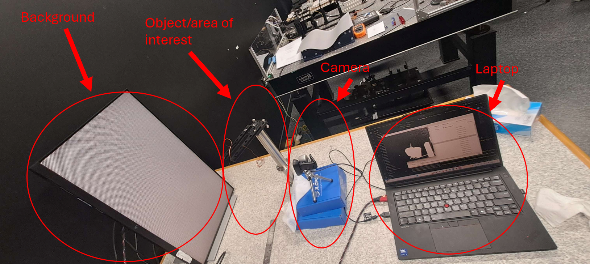

# pyFCD
This repositry contains the python code to visualise airflow using a fast checkerboard demodulation background oriented schlieren (BOS) technique. The technique follows the process outlined by Sander Wildeman: <br>
https://doi.org/10.48550/arXiv.1712.05679  <br>
https://github.com/alexlib/fcd <br>

and T. Shimazaki, S. Ichihara, and Y. Tagawa:<br>
https://doi.org/10.1016/j.expthermflusci.2022.110598


## Getting started
### Prerequisites
Before installing pyFCD, ensure you have the following:
- Python 3.13 or later

### Installing
Clone this repo using git bash (windows) or terminal (linux) into your desired directory:

``` 
git clone https://eng-git.canterbury.ac.nz/elo42/pyfcd.git
```

Download the dependencies using the following command:
```
pip install -r requirements.txt
```
To ensure that the program has been fully installed run 
```
python ./test.py
```

## Deployment
The program has the option to be run in live mode or as a post processing step after recording a video.

The setup to test FCD has used the following setup for both live and post processing methods:


### Running Live
#### Prereqs
To run pyFCD live ensure the following:
1. A camera is attached to the PC/laptop
2. A checkerboard pattern is placed infront of the camera and is in focus
3. Lock the focus (if possible)
4. Ensure the checkerboard pattern covers the majority of the frame. This can be done using any camera application. <br>
NOTE: Solid edges caused by other objects may cause failure to detect the checkerboard pattern frequency at runtime. <br>
This will be given as: ```ReferenceError: Could not detect carrier signal```<br>
Adjust the camera or setup to remove the solid edges 
5. Within the `fcd_live.py` file, change the `CAMERA_NUMBER` variable, located at the top of the file, to the camera in use. 
    - Use `CAMERA_NUMBER = 0` for an inbuilt camera. If there is no inbuilt camera use this also.
    - Use `CAMERA_NUMBER = 1` if there is an inbuilt camera and an external camera. This will use the external camera
    - Camera number may be 2 or more if there are multiple cameras attached. Test using a camera/video application. 


#### Running the Program
If using terminal use `python ./fcd_live.py` command when inside the project directory <br>
or click run on your desired IDE <br>
NOTE: Please adjust the area of interest if a ```ReferenceError: Could not detect carrier signal``` error is produced. See `Prereqs 4.` above.
The following commands can be used while running live:
- r - reset the reference frame. This is useful if the camera is shaken around
- o and p - enhances the ability to visualise the airflow. These adjust the bounds of white/black within the program
- q - Stops the program.

### Post Processing
This method will be used if a recording has been attained and you want to visualise the airflow.

#### Recording a video
1. Use a similar setup to the above (camera pointing to a checkerboard pattern with area of interest inbetween)
2. Record the video. Ideally the first few seconds will have undistirbed airflow

#### Processing
1. Within the `fcd_post.py` file, alter the path of the video to be analysed in `VIDEO_SRC`. 
2. Run the `fcd_post.py` file using either `python ./fcd_post.py` or using an IDE.
3. The processed result will appear in the `./ProcessedVid` directory by default

## Final Notes
### Factors which affect flow visualisation
The results produced by this program is largely altered by the following factors:
* The temperature of the flow being analysed. The higher the temperature gradient, the more visable the flow will be.
* The distance of the flow being analysed from the camera. The closer the flow is to the camera, the better the visualised flow will be. Likewise, the closer the flow is to the checkerboard, patter, the worse the visualisation. 
* Checkerboard width: The smaller the checkerboard widths, the more sensitive it will be to lower temperature gradient flows. 
    * Testing showed that a ice cube flow was faintly visable with a camera placed ~40cm away from the checkerboard with a 720p, 1mm checkerboard pattern.
* Camera quality: The checkerboard width and camera quality are closely linked together. To be able to use a smaller checkerboard pattern, a higher resolution camera is required. Each checkerbard should span roughly 4 pixels of the camera.
* Camera framerate: The higher the frame rate the faster the frame rate must be to accurately capture the flow

### Limitations
* This method is very sensitive to vibrations. If the camera is knocked, press r to reset the reference. If processing it post recording, adjust the `START_SKIP_SECONDS` global to after the shake.


## Built With
pyFCD was built using Windows 11 (24H2) on VS Code using python version 3.13

## License
Eaton

## Acknowledgments
This work has largely been based of the work from Sander Wildeman: 
https://github.com/swildeman


## Project status
In development 